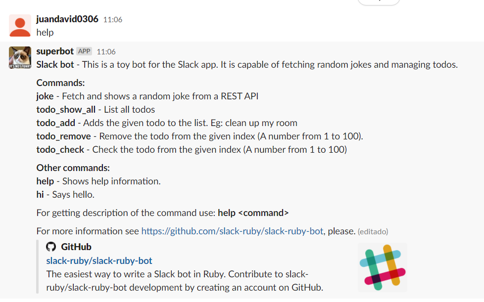

# slack-bot

> Second capstone project of the Microverse program. 

This is a microverse approach to create a Slack bot

## Built With

- Ruby

## Features

- Random joke fetcher
- Todo manager

## Getting Started

### Prerequisites

* Internet connection
* Having Ruby installed on you OS
* Having desktop Slack App installed (Optional)

### Deployment for Microverse TSEs

1. Join to my development Slack workspace (Link in the code review form)
2. Copy `.env` file content to your clipboard (Content in the code review form)
3. Create a `.env` file in the project root folder and paste the content from step 2
4. Open the Slack app in browser or desktop
5. Open a terminal in the project root folder
6. Run `bundle install`
7. Run `bundle exec rackup`

### Deployment

1. Create a Slack workspace [here](https://slack.com/create#email)
2. [Create a Slack bot](http://slack.com/services/new/bot) in your workspace 
2. Copy the API TOKEN to your clipboard
3. Create a `.env` file in the project root folder
5. Paste `SLACK_API_TOKEN=<your_api_token_goes_here>`
6. Open the Slack app in browser or desktop
7. Open a terminal in the project root folder
8. Run `bundle install`
9. Run `bundle exec rackup`

### Usage
After deployment, the bot user should be visible in the Slack workspace, double click to write
a private message with one of the following commands:

- `help` Shows a description of the bot a list every possible command.
- `joke` Fetches a random joke from a REST API
- `todo_show_all` List all the available todos
- `todo_add <arg>` Adds `arg` as a todo. Allowed arguments: Strings.
- `todo_remove <arg>` Removes a todo from the list in the `arg` position. Allowed arguments: Only number from 1 to 100.
- `todo_check <arg>` Checks the todo from the list in the `arg` position. Allowed arguments: Only number from 1 to 100.

## How to run the test cases

1. Open a command line terminal on the project root folder
2. Run `bundle install` to install the gems
3. Run `bundle exec rspec` to run all the test cases

## Authors

👤 **Author - Juan David Piza**

- GitHub: [JuanDavid31](https://github.com/JuanDavid31)
- Twitter: [Juan David Piza](https://twitter.com/jdpw31)

## 🤝 Contributing

Contributions, issues, and feature requests are welcome!

Feel free to check the [issues page](https://github.com/JuanDavid31/slack-bot/issues).

## Show your support

Give a ⭐️ if you like this project!

## Acknowledgments

- To developers, Microverse, ruby official guidelines and The odin Project

## 📝 License

This project is [MIT](https://es.wikipedia.org/wiki/Licencia_MIT) licensed.